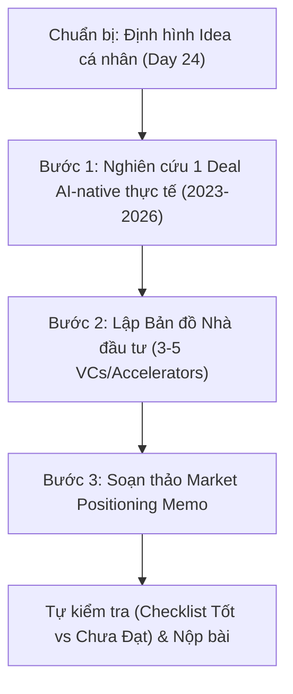

# Kế hoạch Thực hiện Day 26 Lab — Fundraising Intelligence

Tài liệu này hệ thống hóa kiến thức từ bài giảng [d26-Fundraising.pdf](d26-Fundraising.pdf) và vạch ra kế hoạch từng bước cụ thể để hoàn thành bài lab trong [day26-track1-lab.pdf](day26-track1-lab.pdf).

---

## 🎯 Mục tiêu của Lab
1. **Thấu hiểu thực tế gọi vốn**: Định vị thành công 1 deal AI-native thực tế (giai đoạn 2023-2026) theo các framework đã học.
2. **Nghiên cứu Nhà đầu tư (Investor Mapping)**: Lập danh sách 3-5 nhà đầu tư thực tế phù hợp với ý tưởng sản phẩm AI của bản thân (từ A3 Canvas ở Day 24).
3. **Phân tích bối cảnh & Tài chính (Market Positioning Memo)**: Đánh giá tính khả thi (fundability) của ý tưởng dựa trên dữ liệu thị trường thực tế và dự toán tài chính sơ bộ (Unit Economics, Runway, KPIs).

---

## 📅 Lộ trình các bước thực hiện



---

## 📑 Chi tiết Kế hoạch Hành động

### 🧭 Chuẩn bị: Thống nhất thông tin đầu vào (Idea A3 Canvas)
*Trước khi bắt đầu, hãy trả lời 3 câu hỏi cốt lõi về ý tưởng bạn đang build từ Day 24:*
1. **Idea AI product của bạn là gì?** (Ví dụ: AI agent hỗ trợ vận hành logistics, AI SaaS tối ưu hóa nội dung tiếp thị...)
2. **Thuộc Sector/Ngành nào?** (Bám sát xu hướng như Enterprise SaaS, Edtech, Climate Tech, AI Agent...)
3. **Giai đoạn hiện tại của sản phẩm?** (Pre-idea / Prototype / MVP có traction).

---

### 🟢 Bước 1: Tìm kiếm & Định vị 1 Deal AI-native Thực tế
**Mục tiêu**: Chọn ra 1 deal đã gọi vốn thành công từ năm 2023 - 2026 đáp ứng tiêu chí **AI-native** (AI là giá trị cốt lõi, không chỉ là chatbot tích hợp hời hợt).

#### 1. Cách tìm kiếm Deal phù hợp:
*   **Công cụ**: Dùng Google Search, TechCrunch, DealStreetAsia, Crunchbase hoặc e27.
*   **Gợi ý Prompt tìm kiếm:**
    > *"Find 3-5 real AI startup fundraising deals announced between 2023-2026 with disclosed ticket size and investors. The startup must be AI-native (AI as core product/infrastructure, not just a wrapper)."*
*   **Kiểm tra nguồn**: Đảm bảo deal có ít nhất 1 nguồn công bố chính thống (báo tài chính, thông cáo báo chí của quỹ hoặc trang portfolio của chính startup).

#### 2. Điền Deal Case Brief Template:
| Field | Nội dung cần điền |
| :--- | :--- |
| **Tên startup** | Tên công ty thực tế |
| **Sector** | Ngành hoạt động |
| **Vòng gọi vốn** | Pre-Seed / Seed / Series A / Series B / Series C / IPO |
| **Investor(s) tham gia** | Tên quỹ hoặc nhà đầu tư thiên thần dẫn dắt/tham gia |
| **Ticket size** | Số tiền công bố cụ thể (USD) |
| **Thời điểm** | Tháng/Năm công bố |
| **Mô tả deal** | Tóm tắt 2-3 câu ngắn gọn chỉ tập trung vào fact chính |
| **Trích nguồn ngắn** | 1 câu fact kèm nguồn dẫn |
| **Nguồn 1 / Nguồn 2** | Link bài viết hoặc thông cáo chính thức |
| **Độ tin cậy nguồn** | Primary (Trang chủ/Quỹ công bố) hoặc Secondary (Báo chí viết lại) |

#### 3. Định vị deal theo Framework học phần:
*   **Định vị vào Stages Of A Startup Equity Funding**:
    *   *Pre-Seed Funding* (Ý tưởng sơ khai, vốn tự thân/bạn bè)
    *   *Seed Funding* (Sản phẩm thử nghiệm, vốn từ Angel/Accelerator)
    *   *Series A to Series B* (Có traction rõ ràng, vốn từ VC truyền thống)
    *   *Series C* (Mở rộng quy mô, vốn từ quỹ tăng trưởng/PE)
    *   *IPO* (Đại chúng hóa)
*   **Định vị vào bảng Venture Capital vs Private Equity (Slide 6):**
    *   Xác định **Stage of Investment** (Angel / Seed / Growth / Crossover / Late-Stage)
    *   Đối chiếu **Investment Size** thực tế của deal với khung tiêu chuẩn (ví dụ: Seed thường từ $250K - $2M, Growth từ $10M - $50M).
    *   Phân tích **Investor Type** thực tế (Cá nhân, Quỹ sơ khởi, Quỹ Series A-C...).
    *   *Giải thích lý do xếp loại (1-2 câu).*

#### ⚠️ Kiểm chứng sự khác biệt của AI (AI Differentiation Check):
Trả lời 3 câu hỏi để tránh bẫy *"Unclear differentiation"* (Slide 18 bài giảng):
1. AI trong sản phẩm này giải quyết vấn đề gì cụ thể? Nó tối ưu hay tạo ra giá trị khác biệt gì so với giải pháp truyền thống (non-AI)?
2. Nếu bỏ chữ "AI" đi, startup này còn lại lợi thế cạnh tranh cốt lõi nào (proprietary data, workflow riêng biệt, network effect, distribution channel...)?
3. Deal này có rơi vào bẫy *"Unclear differentiation"* không? Giải thích rõ vì sao.

---

### 🔵 Bước 2: Nghiên cứu Investor Mapping cho Idea Cá nhân
**Mục tiêu**: Lọc ra **3-5 nhà đầu tư (VC/Accelerator/Angel)** thực tế đang hoạt động và có khẩu vị (thesis) phù hợp với ý tưởng của bạn.

#### 1. Cách lọc nhà đầu tư (Dùng phương pháp "Lists"):
*   Sử dụng cơ sở dữ liệu Crunchbase hoặc danh sách portfolio của các quỹ.
*   **Tiêu chí lọc:**
    *   *Headquarters / Target Location*: Đông Nam Á / Việt Nam / Toàn cầu (tùy thuộc vào thị trường mục tiêu của bạn).
    *   *Investor Type*: Venture Capital hoặc Accelerator.
    *   *Operating Status*: Active.
    *   *Gợi ý bắt đầu*: **Techstars, Antler, 500 Global** (các bên rất tích cực ở giai đoạn Early-stage tại Đông Nam Á).

#### 2. Lập Bảng Investor Mapping Table:
| Nhà đầu tư / Quỹ | Loại nhà đầu tư | Sector & Stage tập trung | Ticket size điển hình | Vì sao fit với idea của bạn? | Nguồn đối chiếu |
| :--- | :--- | :--- | :--- | :--- | :--- |
| **(1)** | Angel/Seed VC... | Giai đoạn & Ngành đầu tư | Khung đầu tư thông thường | Chứng minh thesis fit | Link portfolio/thesis |
| **(2)** | ... | ... | ... | ... | ... |
| **(3)** | ... | ... | ... | ... | ... |

#### 📝 Phân tích sâu cho mỗi nhà đầu tư:
Với từng quỹ trong danh sách, hãy làm rõ:
*   **Investment Thesis**: Khẩu vị đầu tư của họ là gì? Họ ưu tiên mô hình B2B SaaS, AI-native services, hay B2C?
*   **Portfolio Check**: Họ đã đầu tư vào startup nào cùng lĩnh vực chưa? Có bị xung đột lợi ích (competitive investment) với bạn không?
*   **Typical Ticket Size & Criteria**: Quy mô đầu tư trung bình và các tiêu chí tuyển chọn (như đội ngũ sáng lập, quy mô thị trường tối thiểu, yêu cầu về tỷ lệ cổ phần sở hữu...).
*   **Lý do đầu tư**: Tại sao họ nên đầu tư vào bạn ngay bây giờ? Hoặc ngược lại, rủi ro khiến họ từ chối là gì?

---

### 🟡 Bước 3: Soạn thảo Market Positioning Memo
**Mục tiêu**: Viết một bản Memo ngắn gọn (từ 0.5 đến 1 trang giấy) trả lời câu hỏi: **"Ý tưởng của tôi có khả năng gọi vốn (fundable) trong bối cảnh hiện tại không, và tôi cần bằng chứng gì để chứng minh điều đó?"**

#### 1. Tích hợp dữ liệu thị trường từ bài giảng (Slide 7 - 14):
Để tăng tính thuyết phục, Memo của bạn cần tham chiếu đến các dữ liệu thực tế sau:
*   **Sự suy giảm dòng vốn**: Giá trị và số lượng deal VC tại Việt Nam giảm liên tục (~30% vào cuối 2025 so với đỉnh 2021). Quy mô check size trung bình cũng co lại đáng kể.
*   **Điểm sáng AI Agent**: Mặc dù thị trường chung ảm đạm, nguồn vốn rót vào AI Agent tăng trưởng bùng nổ (162 deal, trị giá 3.8 tỷ USD lũy kế đến năm 2024).
*   **Xu hướng YC Summer 2026**: Sự chuyển dịch từ ứng dụng tiêu dùng sang các doanh nghiệp dịch vụ AI-native (*AI-Native Service Companies*), phần mềm cho tác tử (*Software for Agents*), và các giải pháp thách thức SaaS truyền thống (*SaaS Challengers*).

#### 📊 2. Giải quyết lỗi "Unclear Financials" (Tài chính mập mờ):
Trình bày rõ ràng các giả định tài chính sơ bộ của ý tưởng sản phẩm:
*   **Unit Economics (Kinh tế đơn vị) ước tính:**
    $$\text{Contribution Margin} = \text{Doanh thu trên 1 khách hàng} - \text{Chi phí phục vụ khách hàng đó}$$
    *(Nêu rõ các giả định đằng sau con số: Chi phí hạ tầng LLM API, chi phí vận hành so với mức giá gói cước dự kiến của user).*
*   **Cash needs / Runway**: Bạn cần bao nhiêu tiền để sống sót và phát triển đến cột mốc tiếp theo? Thời gian runway dự kiến là bao nhiêu tháng?
*   **KPIs tới vòng tiếp theo**: 1-2 con số cụ thể bạn cam kết đạt được bằng số tiền gọi được (ví dụ: Số lượng Active Users, Doanh thu ARR/MRR, Tỷ lệ giữ chân người dùng Retention Rate...).

---

## 🗂️ Cấu trúc Thư mục Nộp bài (Repository)
Khi tạo repository cá nhân với tên định dạng `Day26-Track1-MaHV-HoVaTen`, hãy cấu trúc thư mục như sau để bài làm mạch lạc:

```text
Day26-Track1-MaHV-HoVaTen/
│
├── README.md                     # Giới thiệu tổng quan về Lab 26
├── Deal_Case_Brief.md            # Nội dung Bước 1 (Brief deal thực tế + Framework)
├── Investor_Mapping.md           # Nội dung Bước 2 (Danh sách & Đánh giá fit nhà đầu tư)
└── Market_Positioning_Memo.md    # Nội dung Bước 3 (Memo thị trường & Tài chính sơ bộ)
```

---

## 🔍 Checklist Tự Kiểm tra Chất lượng (TỐT vs CHƯA ĐẠT)

Trước khi đóng gói repo và nộp link, hãy đối chiếu bài làm với bảng tiêu chí chấm điểm dưới đây:

| Phần | ❌ CHƯA ĐẠT (Mơ hồ, thiếu số liệu) |  TỐT (Cụ thể, có bằng chứng thực tế) |
| :--- | :--- | :--- |
| **Số liệu Deal** | *"Startup này gọi được khá nhiều vốn ở vòng Seed"* | *"Gọi vốn thành công 2.5 triệu USD vòng Seed, dẫn dắt bởi quỹ A, công bố vào tháng 3/2025 theo link báo chí X."* |
| **Độ biệt lập AI** | *"Sản phẩm của chúng tôi dùng AI nên chắc chắn sẽ tối ưu và khác biệt."* | Phân tích rõ: *"AI dùng cho quy trình xử lý dữ liệu độc quyền Y giúp giảm 80% thời gian xử lý so với giải pháp thủ công. Nếu bỏ AI, sản phẩm vẫn giữ chân khách hàng nhờ workflow tích hợp sâu vào hệ thống CRM sẵn có của họ."* |
| **Investor Mapping** | *"Quỹ này đầu tư công nghệ nên chắc chắn họ sẽ thích ý tưởng của tôi."* | *"Quỹ đã công khai đầu tư vào giai đoạn Seed tại SEA, từng rót vốn vào startup Z cùng lĩnh vực nhưng thị trường khác, ticket size thông thường từ $500K - $1M rất khớp với nhu cầu của tôi."* |
| **Tài chính sơ bộ** | *"Mô hình kinh doanh của chúng tôi dự kiến sẽ tạo ra lợi nhuận cao."* | *"Ước tính: Người dùng trả 20$/tháng; chi phí vận hành và API LLM tốn 5$/tháng/user $\rightarrow$ Contribution margin ước tính đạt 15$/tháng/user dựa trên giả định X."* |
