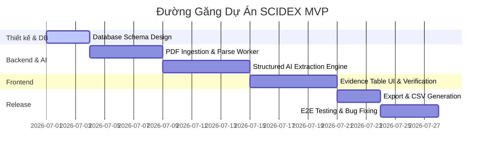

# 🗺️ Sơ Đồ Phụ Thuộc & Đường Găng Dự Án (Dependency Map & Critical Path)

Tài liệu này xác định các điểm phụ thuộc kỹ thuật/vận hành quan trọng của dự án **SCIDEX** và đưa ra kịch bản dự phòng (Plan B) tương ứng nhằm giảm thiểu rủi ro, đồng thời xác định Đường găng (Critical Path) của dự án.

---

## 📂 1. Sơ Đồ Phụ Thuộc & Kịch Bản Dự Phòng (Dependencies & Plan B)

Dự án xác định **3 điểm phụ thuộc (Dependencies)** cốt lõi dưới đây:

### 🔗 Điểm Phụ Thuộc 1: API Tìm Kiếm Học Thuật Ngoài (Semantic Scholar / OpenAlex API)
*   **Chi tiết:** Hệ thống phụ thuộc vào API ngoài để tìm kiếm metadata bài báo khoa học, lấy thông tin tác giả, năm xuất bản, DOI và tự động tải các tệp PDF open-access.
*   **Rủi ro:** API bị giới hạn tần suất gọi (Rate Limit), thay đổi cấu trúc dữ liệu phản hồi, hoặc dịch vụ gặp sự cố downtime đột xuất.
*   **🛡️ Kịch bản dự phòng (Plan B):**
    1.  Cho phép người dùng hoàn toàn bỏ qua bước Search trực tuyến. Hệ thống cung cấp luồng **Upload PDF thủ công** và tự điền metadata cơ bản (Title, Authors, Year) bằng tay.
    2.  Triển khai bộ nhớ đệm (Caching) bằng Redis để lưu trữ kết quả của các truy vấn tìm kiếm phổ biến, tránh gọi API liên tục.
    3.  Tích hợp song song nhiều nhà cung cấp (Multi-connector): Nếu Semantic Scholar lỗi, tự động chuyển đổi sang OpenAlex hoặc arXiv.

### 🧠 Điểm Phụ Thuộc 2: API Nhà Cung Cấp LLM (OpenAI GPT / Anthropic Claude)
*   **Chi tiết:** Hệ thống sử dụng mô hình LLM thương mại để trích xuất dữ liệu có cấu trúc từ văn bản bài viết và vận hành chatbot giải thích dẫn chứng.
*   **Rủi ro:** Chi phí token tăng đột biến khi người dùng upload nhiều tài liệu dài, độ trễ (latency) của API cao trong giờ cao điểm, hoặc tài khoản API bị tạm ngưng/hết quota.
*   **🛡️ Kịch bản dự phòng (Plan B):**
    1.  **Cơ chế Dual-Provider Routing:** Thiết lập hệ thống chuyển mạch API tự động. Sử dụng mô hình chi phí thấp (GPT-4o-mini) cho các tác vụ trích xuất đơn giản, và chỉ sử dụng mô hình cao cấp (Claude 3.5 Sonnet) khi trích xuất thất bại hoặc cần giải quyết mâu thuẫn phức tạp.
    2.  **Hỗ trợ Custom API Key:** Cho phép người dùng cấu hình khóa API (OpenAI/Anthropic) của riêng họ trong phần cài đặt để tự chịu chi phí token khi vượt quá quota miễn phí của hệ thống.
    3.  **Local LLM Fallback (Dài hạn):** Xây dựng phương án chạy mô hình mã nguồn mở local (như Llama-3-8B hoặc Qwen-2.5-7B) trên máy chủ riêng để trích xuất dữ liệu thô nếu các API ngoài hoàn toàn không khả dụng.

### 📄 Điểm Phụ Thuộc 3: Hạ Tầng Parse Bố Cục PDF (Grobid / PyMuPDF Service)
*   **Chi tiết:** Để LLM trích xuất chính xác, hệ thống phải parse thành công tệp PDF phi cấu trúc thành các đoạn văn bản sạch, định dạng bảng biểu và xác định đúng số trang.
*   **Rủi ro:** Grobid chạy local bị treo do tràn bộ nhớ khi gặp PDF hàng trăm trang, hoặc PyMuPDF bị lỗi font chữ khi xử lý các tài liệu cũ không theo chuẩn Unicode.
*   **🛡️ Kịch bản dự phòng (Plan B):**
    1.  Thiết lập hàng đợi bất đồng bộ **Celery Worker** với cơ chế Timeout và Retry tự động. Nếu một tiến trình parse tệp bị treo quá 60 giây, worker sẽ tự động hủy task và chuyển sang chế độ parse text thô (Simple Parser Fallback) thay vì phân đoạn cấu trúc phức tạp.
    2.  Cung cấp khung soạn thảo thủ công trực tiếp trên UI. Nếu tài liệu parse lỗi, người dùng có thể mở tệp PDF bên cạnh và tự bôi đen, sao chép văn bản dán vào bảng trích xuất.

---

## 🛣️ 2. Đường Găng Của Dự Án (Critical Path)

Đường găng là chuỗi các nhiệm vụ bắt buộc phải hoàn thành đúng thời hạn để dự án không bị chậm tiến độ. Đối với SCIDEX MVP, đường găng kéo dài trong **4 tuần** bao gồm các bước sau:

### Các nhiệm vụ thuộc Đường găng:
1.  **Thiết kế Database Schema (3 ngày):** Định hình cấu trúc bảng lưu trữ các cell dữ liệu trích xuất và nguồn dẫn chứng (Evidence Source). Đây là nền tảng cho cả Backend và Frontend.
2.  **PDF Ingestion & Parsing (5 ngày):** Xây dựng module upload PDF lên Cloudflare R2 và kích hoạt Celery worker parse PDF thành các text chunks có tọa độ và số trang.
3.  **Structured AI Extraction Engine (6 ngày):** Phát triển logic gọi LLM trích xuất dữ liệu, định dạng JSON và ghi nhận bằng chứng nguồn.
4.  **Evidence-linked Table UI & User Verification (6 ngày):** Thiết kế giao diện bảng dữ liệu tương tác giúp người dùng click vào ô để xem dẫn chứng, chỉnh sửa trực tiếp và nhấn xác nhận (Verify).
5.  **Export CSV/Excel Engine (3 ngày):** Viết tính năng xuất file báo cáo dữ liệu sạch ra máy tính.
6.  **E2E Integration Testing & Bug Fixing (4 ngày):** Kiểm thử toàn bộ luồng từ lúc tải PDF lên đến lúc export file Excel để bàn giao bản demo ổn định.

> **Lưu ý:** Các tính năng như *Academic Search API (Tìm kiếm bài viết)* và *AI Chat Bot (Hỏi đáp nâng cao)* nằm ngoài đường găng MVP, có thể phát triển song song hoặc lùi lại ở các phase tiếp theo mà không làm chậm tiến độ ra mắt sản phẩm cốt lõi.
